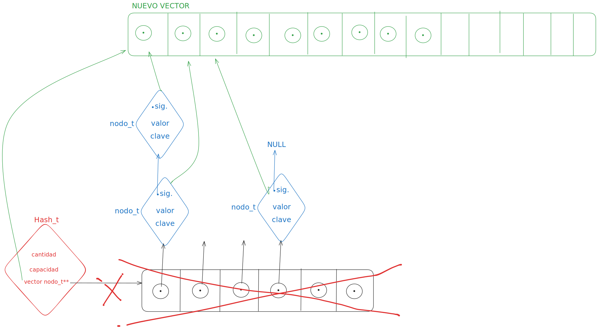
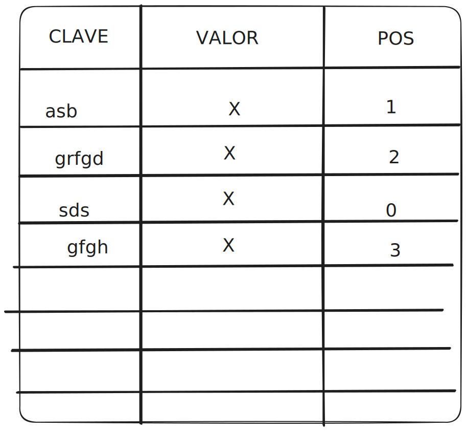
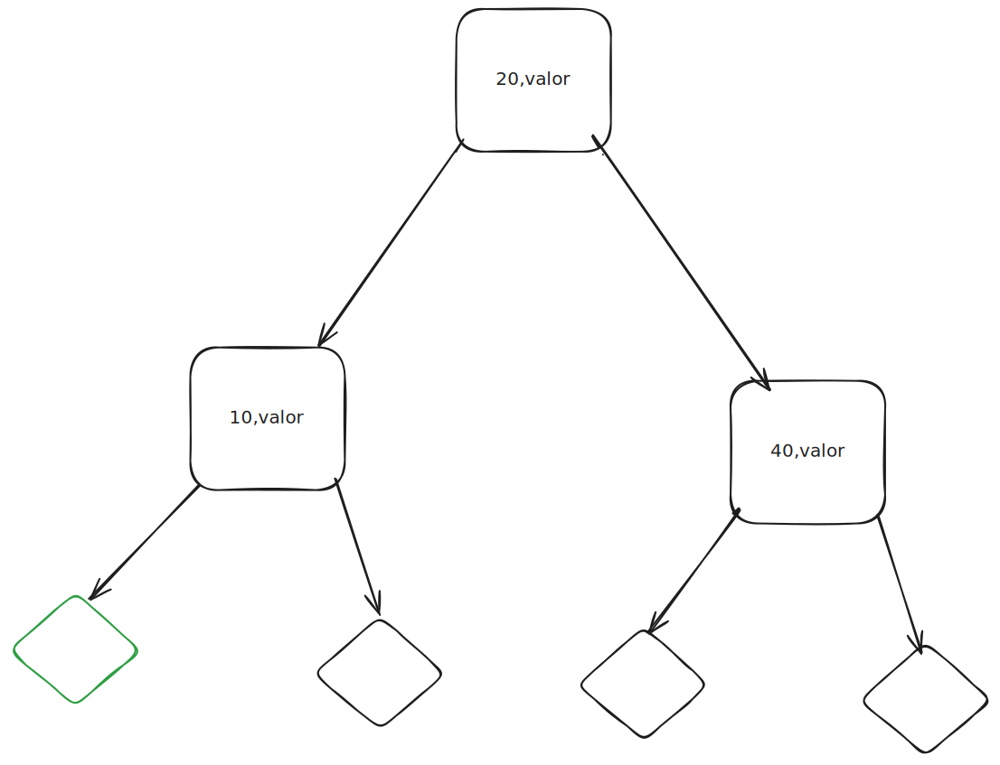
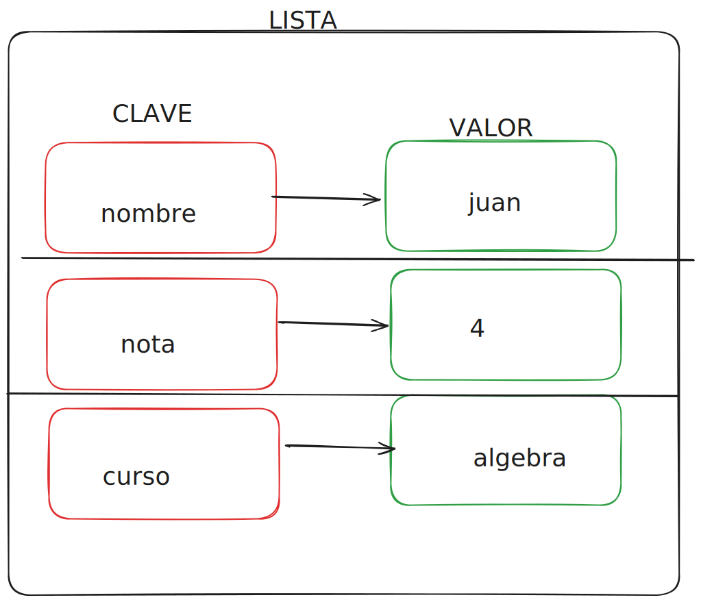

<div align="right">

</div>

# TDA HASH

## Repositorio de Nicolas Martin Guerrero - 112514 - guerreronico81@gmail.com
- Para compilar:

```bash
gcc *.c src/*.c
```

- Para ejecutar:

```bash
./a.out pokedex.csv
```

- Para ejecutar con valgrind:
```bash
valgrind ./a.out pokedex.csv
```
---
##  Funcionamiento

Para realizar este diccionario utilicé 2 estructuras, una del hash y otra de nodos. El struct hash guarda la cantidad de elementos, la capacidad maxima del hash y un puntero a un vector de nodos. Los noodos guardan una clave, un valor y un puntero al suigiente nodo.El vector del hash es de tipo `nodo_t**`, osea, un vector de puneteros nodo_t. Esto me permite tener un vector facil de manejar y de remplazar en el rehash.
<div align="center">

</div>


En mi implementacion del hash use el mismo enfoque con todas las funciones del TDA de la siguiente manera:

* Recorro el vector de nodos o, si tengo una clave como parametro, encuentro la posicion del vector en la que estoy interesado con la funcion de Hash.
* Por cada posicion del vector llamo a una funcion que se encarga de moverse por los nodos conectados para realizar una busqueda,insercion o eliminacion.
* Finalmente devuelvo el resultado de la funcion de nodos.

Decidi hacerlo de esta manera para tener bien separado el funcionamiento en la tabla(vector) del hash y el funcionamiento de los nodos en cada posicion de la tabla.

Para crear nodos con claves copiadas utilizo malloc y strcpy. Asi la clave no puede ser modificada desde afuera.
```c
nuevo_nodo->clave = malloc(strlen(clave) + 1);
	if (nuevo_nodo->clave == NULL) {
		free(nuevo_nodo);
		return NULL;
	}
	strcpy(nuevo_nodo->clave, clave);
```
Cada insercion en la tabla tambien verifica que esta misma no este muy llena, si lo está, tengo que hacer un Rehash.
Para hacer el Rehash primero creo un vector de `nodo_t**` con el doble de capacidad que el original y empiezo a mover los nodos del vector original al nuevo vector.
```c
for (size_t i = 0; i < hash->capacidad; i++) {
		nodo_t *aux = hash->vector[i];
		while (aux != NULL) {
			size_t pos = funcion_hash(aux->clave, nueva_capacidad);
			nodo_t *siguiente = aux->siguiente;

			aux->siguiente = nuevo_vector[pos];
			nuevo_vector[pos] = aux;

			aux = siguiente;
		}
	}
```
* Recorro cada posicion del vector original y le asigno un ptr aux `nodo_t *aux = hash->vector[i];`
* Calculo la posicion del nodo en el nuevo vector
* Guardo el siguiente nodo para no perderlo`nodo_t *siguiente = aux->siguiente;`
* Apunto el puntero al siguiente nodo de AUX a lo que sea que esté en donde voy a poner a AUX`aux->siguiente = nuevo_vector[pos];`
* Meto a AUX en el nuevo vector`nuevo_vector[pos] = aux;` y como AUX->siguiente apunta a lo que estaba antes en `nuevo_vector[pos]` no se pierde nada
* Finalmente avanzo al siguiente nodo`aux = siguiente;`
<div align="center">

</div>
Asi el rehash aumenta la capacidad y mueve los nodos, asi que la cantidad se mantiene igual y la evito tener errores con la cantidad. 

Al momento de decidir como hacer mi funcion hash, use algo que discutimos en clase. Multiplicar el valor ascii de cada caracter por una constante y despues sumar todas los resultados, para dividir el total por la capacidad del hash y quedarme con el resto.
`(sumatoria de char *7)%capacidad`


---

## Respuestas a las preguntas teóricas

* Qué es un diccionario - Explicá 3 formas diferentes de implementar un diccionario (tabla de hash cuenta como 1)
* Qué es una función de hash y qué características debe tener para nuestro problema en particular
* Qué es una tabla de Hash y los diferentes métodos de resolución de colisiones vistos (encadenamiento, probing, etc)
* Explique por qué es importante el tamaño de la tabla (tanto para tablas abiertas como cerradas)
* Dado que en una tabla abierta se pueden encadenar colisiones sin importar el tamaño de la tabla, ¿Realmente importa el tamaño?


Un diccionario es una coleccion de pares(clave,valor) en la cual, la clave funciona como indice por el cual se puede acceder al elemento almacenado. Las claves pueden ser unicas o no, depende de la implementación. La ventaja del diccionario es la facilidad y velocidad de acceso a los elementos, ya que no hay que recorrer el diccionario para encontrar la ubicacion de la clave.

Se puede implementar un diccionario como:

-una `tabla` que utiliza una funcion hash para calcular la posicion de los pares en relacion de su clave. La funcion hash debe repartir las claves entre las posiciones del vector de manera efectiva, para evitar muchas coliciones.
<div align="center">

</div>
La tabla Hash maneja las coliciones de diferentes maneras, las 2 maneras principales que vimos son tabla abierta y tabla cerrada. En la tabla abierta, diferentes claves pueden encontrarse en la misma sposicion de un vector, pero se encadenan resultando en una cadena de pares que tienen una posicion compartida en el vector(es el tipo de implementacion que realizamos). Otra manera es con la tabla cerrada, en esta todos los elementos se almacenan directamente en el vector. Si ocurre una colisión, se busca otra posición vacía siguiendo una estrategia. Puede ser `Probing lineal` , `probing cuadratico` o `hash doble`. 

El Probing lineal busca el siguiente espacio libre inmediato. El Probing cuadrático (intentos fallidos)2 para intentar,osea, en lugar de avanzar linealmente utiliza un incremento cuadrático. El Hash doble aplica una segunda función de hash a la clave cuando hay colisión.


-un ABB en el que cada nodo tiene una clave, un valor y referencias a sus hijos izquierdo y derecho.
<div align="center">

</div>

-una lista donde los pares clave-valor se mantienen ordenados por las claves. Como los diccionarios de Python.
<div align="center">

</div>
---


El tamaño de la tabla es esencial tanto en tablas abiertas como en cerradas, ya que afecta directamente el rendimiento de las operaciones. Las tablas utilizan una funcion hash y esta funcion hash calcula una posicion basada en el tamaño de la tabla, con menos espacio hay más coliciones. 
En las tablas abiertas las coliciones son manejadas por el encadenamiento, pero para mantener esta cadena con un rendimiento optimo la cadena no debe ser muy larga, osea, no tienen que suceder muchas coliciones y como dijimos antes, tener poco tamaño genera más coliciones.


