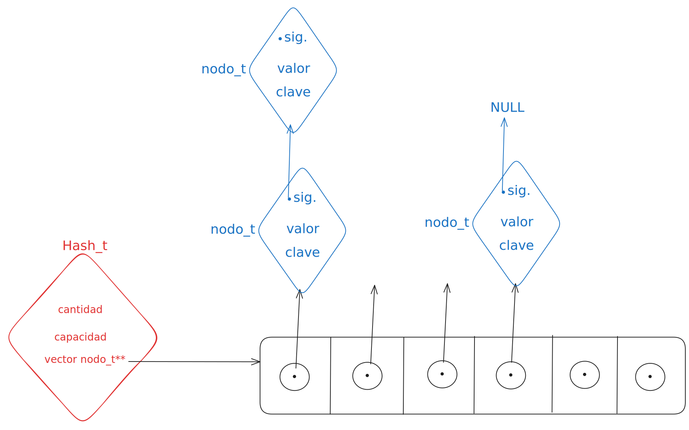

<div align="right">

</div>

# TDA HASH

## Repositorio de Nicolas Martin Guerrero - 112514 - guerreronico81@gmail.com
- Para compilar:

```bash
gcc *.c src/*.c
```

- Para ejecutar:

```bash
./a.out pokedex.csv
```

- Para ejecutar con valgrind:
```bash
valgrind ./a.out pokedex.csv
```
---
##  Funcionamiento

Para realizar este diccionario utilicé 2 estructuras, una del hash y otra de nodos. El struct hash guarda la cantidad de elementos, la capacidad maxima del hash y un puntero a un vector de nodos. Los noodos guardan una clave, un valor y un puntero al suigiente nodo.El vector del hash es de tipo `nodo_t**`, osea, un vector de puneteros nodo_t. Esto me permite tener un vector facil de manejar y de remplazar en el rehash.
<div align="center">

</div>


En mi implementacion del hash use el mismo enfoque con todas las funciones del TDA de la siguiente manera:

* Recorro el vector de nodos o, si tengo una clave como parametro, encuentro la posicion del vector en la que estoy interesado con la funcion de Hash.
* Por cada posicion del vector llamo a una funcion que se encarga de moverse por los nodos conectados para realizar una busqueda,insercion o eliminacion.
* Finalmente devuelvo el resultado de la funcion de nodos.

Decidi hacerlo de esta manera para tener bien separado el funcionamiento en la tabla(vector) del hash y el funcionamiento de los nodos en cada posicion de la tabla.

Para crear nodos con claves copiadas utilizo malloc y strcpy. Asi la clave no puede ser modificada desde afuera.
```c
nuevo_nodo->clave = malloc(strlen(clave) + 1);
	if (nuevo_nodo->clave == NULL) {
		free(nuevo_nodo);
		return NULL;
	}
	strcpy(nuevo_nodo->clave, clave);
```
Cada insercion en la tabla tambien verifica que esta misma no este muy llena, si lo está, tengo que hacer un Rehash.
Para hacer el Rehash primero creo un vector de `nodo_t**` con el doble de capacidad que el original y empiezo a mover los nodos del vector original al nuevo vector.
```c
for (size_t i = 0; i < hash->capacidad; i++) {
		nodo_t *aux = hash->vector[i];
		while (aux != NULL) {
			size_t pos = funcion_hash(aux->clave, nueva_capacidad);
			nodo_t *siguiente = aux->siguiente;

			aux->siguiente = nuevo_vector[pos];
			nuevo_vector[pos] = aux;

			aux = siguiente;
		}
	}
```
* Recorro cada posicion del vector original y le asigno un ptr aux `nodo_t *aux = hash->vector[i];`
* Calculo la posicion del nodo en el nuevo vector
* Guardo el siguiente nodo para no perderlo`nodo_t *siguiente = aux->siguiente;`
* Apunto el puntero al siguiente nodo de AUX a lo que sea que esté en donde voy a poner a AUX`aux->siguiente = nuevo_vector[pos];`
* Meto a AUX en el nuevo vector`nuevo_vector[pos] = aux;` y como AUX->siguiente apunta a lo que estaba antes en `nuevo_vector[pos]` no se pierde nada
* Finalmente avanzo al siguiente nodo`aux = siguiente;`


<div align="center">

</div>

Explicá teóricamente los siguientes puntos (no necesariamente en orden, pero por favor usando diagramas):

Qué es un diccionario - Explicá 3 formas diferentes de implementar un diccionario (tabla de hash cuenta como 1)
Qué es una función de hash y qué características debe tener para nuestro problema en particular
Qué es una tabla de Hash y los diferentes métodos de resolución de colisiones vistos (encadenamiento, probing, etc)
Explique por qué es importante el tamaño de la tabla (tanto para tablas abiertas como cerradas)
Dado que en una tabla abierta se pueden encadenar colisiones sin importar el tamaño de la tabla, ¿Realmente importa el tamaño?
Mas te vale que expliques con dibujos
---

## Respuestas a las preguntas teóricas
Incluír acá las respuestas a las preguntas del enunciado (si aplica).
